<div align="center">

# 📚 PaperSage

**面向科研阅读与写作的 AI 智能体工作台**

[](https://www.python.org/)
[](CHANGELOG.md)
[](LICENSE)
[](https://python.langchain.com/)
[](https://langchain-ai.github.io/langgraph/)
[](https://streamlit.io/)
[](https://google.github.io/A2A/)
[](Dockerfile)
[](https://github.com/astral-sh/uv)

[English](README_EN.md) · [简体中文](#) · [CHANGELOG](CHANGELOG.md) · [文档](docs/)

</div>

---

<div align="center">

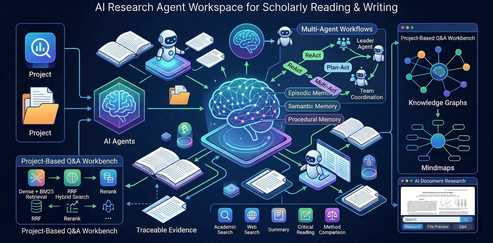

> 基于 **Streamlit + LangChain + LangGraph** 构建。  
> 以"项目化论文问答工作台"为核心：按项目组织文档、限定检索范围、自动路由 Agent 工作流、输出可追溯证据。

</div>

---

## ✨ 核心能力一览

| 能力 | 说明 |
|------|------|
| 🔀 **多模式 Agent 工作流** | ReAct / Plan-Act / Plan-Act-RePlan 三级工作流，智能路由自动选择 |
| 🤝 **Multi-Agent 团队协作** | Leader 中心调度，LLM 动态生成角色，依赖拓扑派发，多轮 review-replan |
| 🔍 **本地 Hybrid RAG** | Dense + BM25 + RRF + Rerank 四阶检索，结构化证据可追溯至原文 |
| 💾 **轻量持久化向量库** | 默认 `auto` 优先使用 Chroma 本地持久化（不可用时自动回退内存向量存储） |
| 🧠 **长短期记忆系统** | episodic / semantic / procedural 三类记忆，差异化 TTL，时效衰减检索 |
| 🛠️ **14+ 内置工具** | RAG 检索、文件读写、学术搜索、网络检索、Todo 管理、人工确认等 |
| 📝 **可插拔技能体系** | 论文总结、批判性阅读、方法对比、翻译、思维导图，从 SKILL.md 动态加载 |
| 🗂️ **项目化工作区** | 多项目隔离、文档绑定、独立会话与上下文 |

---

## 🖼️ 功能截图

### Agent 中心 — 智能问答
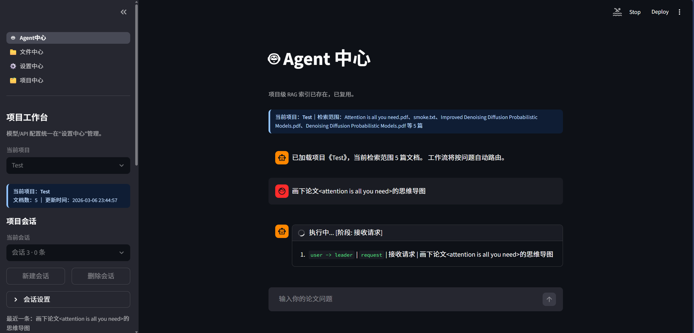

### Agent 中心 — 智能动态协作 (Team 模式)
面对复杂的对比、调研或工程任务，系统会自动从单智能体切换为多智能体 Team 模式。

- **动态角色生成**：Leader 根据任务复杂度（如“对比纯视觉与激光雷达自动驾驶方案”）自动生成 `researcher`（资料收集）、`comparer`（多维对比）和 `writer`（报告撰写）等互补角色。
- **DAG 任务拆解与多轮协作**：自动将大目标拆解为有向无环图（DAG）的并行子任务（如收集成本数据、收集精度数据），并按需进行多轮（Round）交叉验证。
- **渐进式工具披露与自主激活**：为避免长上下文污染，系统默认只暴露基础 RAG 工具。但团队成员会根据任务需要，自主调用 `activate_tool` 动态加载并使用 `search_web`（联网搜索）、`bash`（代码执行）等高级工具，或是通过 `use_skill` 引入专家级的思考模板。

**💡 真实案例（DeepSeek-V3 自动联网检索）：**
当询问：“*对比纯视觉自动驾驶和激光雷达方案的优缺点。由于本地没有资料，你可以自行寻找出路。*”
系统会自动规划出以下链路：
1. `researcher` 尝试本地检索发现无果。
2. 自动调用 `activate_tool(tool_name="search_web")` 解锁联网能力。
3. 自动执行 `search_web` 并发多线程抓取全网相关前沿论文与讨论。
4. `writer` 整合信息并直接返回结构化的深度分析报告，全程无需人工干预。

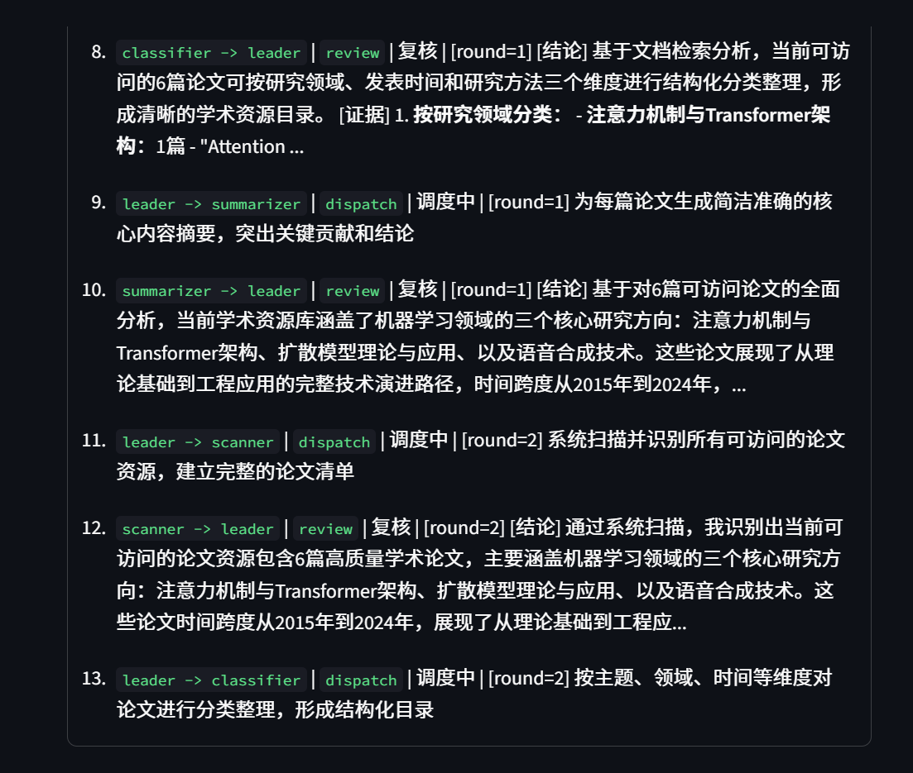

### 文件中心 — 文档管理

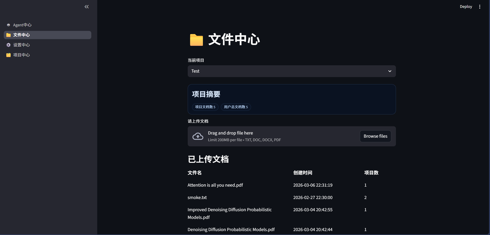

### 论文问答 — 证据追溯

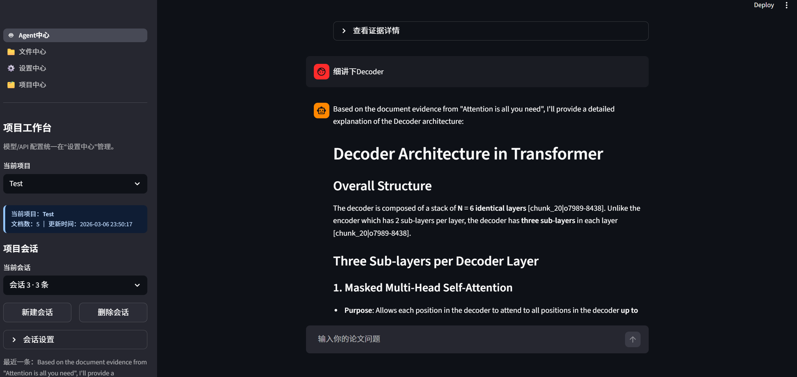

### 思维导图 — 可视化

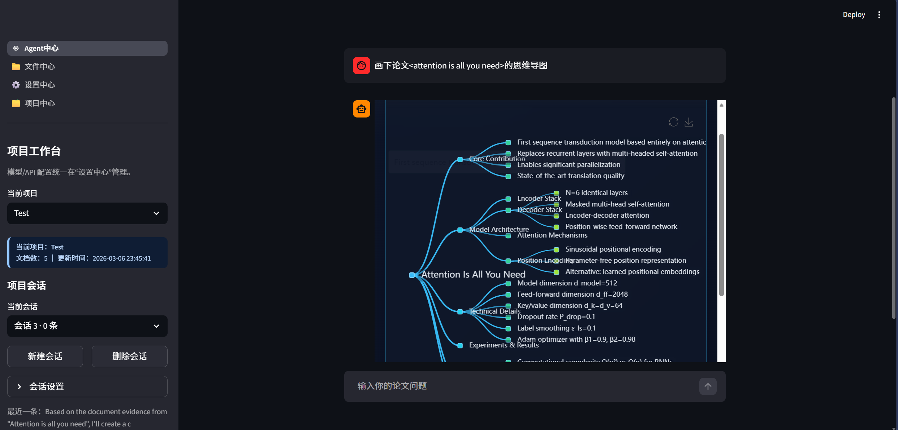

### 论文总结

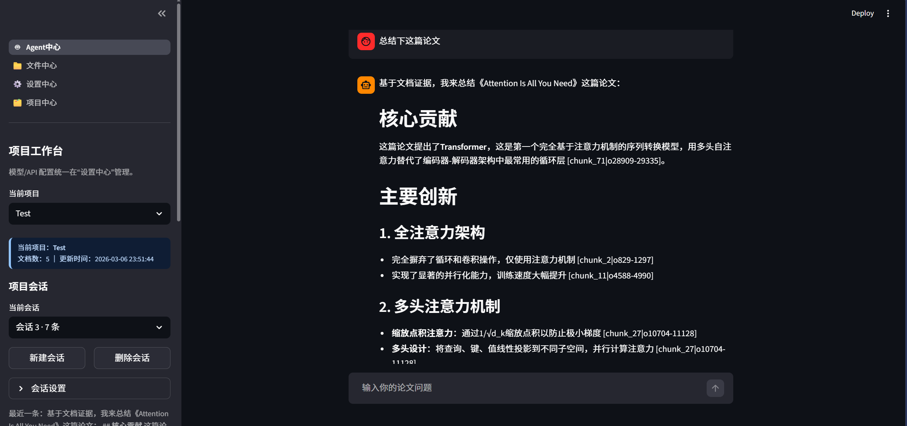

### 上下文治理 — 可视化

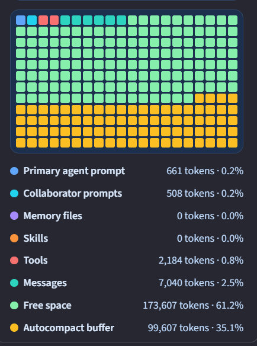


---

## 🏗️ 架构设计

### 当前执行链路与模式提示

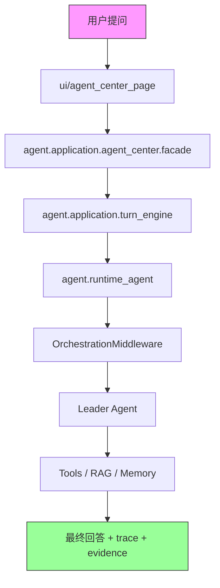

当前版本不再使用独立的 `policy_engine` / `async interceptor` 作为主入口前路由器。复杂度分析、计划/团队提示和 trace 事件由 middleware 链负责，canonical 入口是 `turn_engine + runtime_agent + middlewares`。

### Hybrid RAG 检索管线

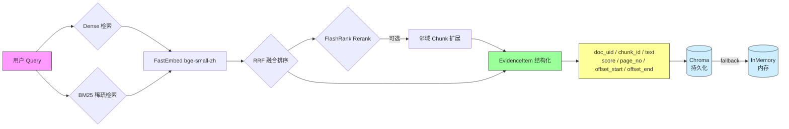

### 长短期记忆架构

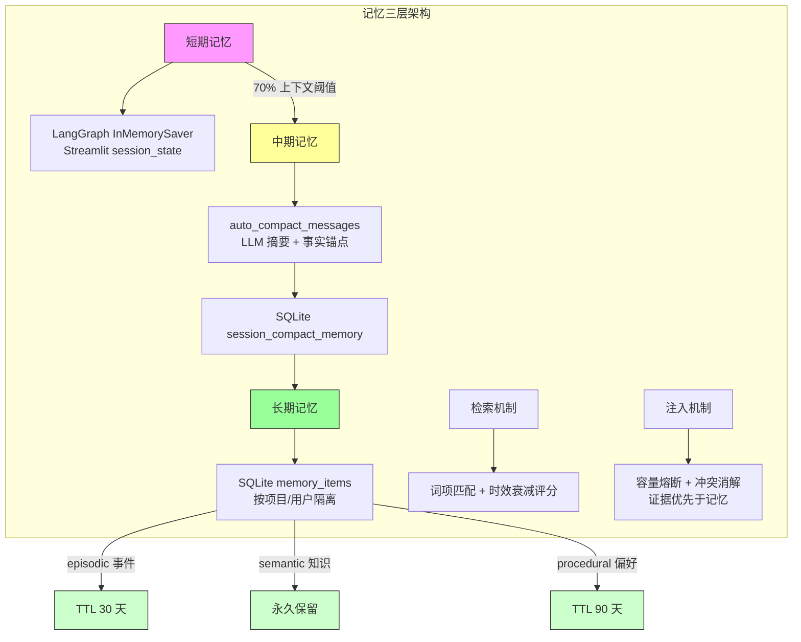

---

## 📄 页面导航

| 页面 | 说明 |
|------|------|
| 🤖 **Agent 中心**（默认） | 智能问答主界面，工作流可视化，证据展示 |
| 📁 **文件中心** | 文档上传、格式转换、内容预览 |
| ⚙️ **设置中心** | API Key、模型、RAG 参数、Agent 行为配置 |
| 🗂️ **项目中心** | 项目管理、文档绑定、工作区切换 |

---

## 🚀 快速开始

### 方式一：PyPI 安装（推荐）

> 适合直接使用，无需克隆仓库。

**Linux / macOS**

```bash
# 安装（推荐 uv tool，自动注册全局命令）
uv tool install paper-sage

# 启动
paper-sage
```

**Windows（PowerShell）**

```powershell
# 安装
uv tool install paper-sage

# 启动（Windows 下用不带连字符的命令）
papersage
```

> ⚠️ **不要用 `uv pip install`**：该方式不会将命令写入全局 PATH，需手动激活虚拟环境后才能使用。

浏览器访问 `http://localhost:8501`，在 **⚙️ 设置中心** 填写 API Key 和模型名称即可开始使用。

---

### 方式二：克隆源码本地启动

```bash
# 克隆仓库
git clone https://github.com/0verL1nk/PaperSage.git
cd PaperSage

# 安装依赖
uv sync --no-install-project

# 启动应用
streamlit run main.py
```

### 方式三：Docker 部署

```bash
docker-compose up --build
```

- `docker-compose` 模式默认启用 MinerU 解析（`DOC_PARSE_BACKEND=mineru`）。
- 直接本地 `streamlit run main.py` 不会启用 MinerU，仍使用本地解析链路（MarkItDown / PyMuPDF）。
- 若本地没有 `mineru:latest` 镜像，请先按 MinerU 官方文档构建或在 `.env` 中改 `MINERU_IMAGE`。

---

### 环境要求

- Python `>= 3.10`
- [uv](https://github.com/astral-sh/uv)（推荐包管理器）

---

## 🗂️ 项目结构

```text
.
├── main.py                     # Streamlit 导航入口
├── pages/                      # 四个功能页面
├── agent/                      # 🧠 Agent 核心（77 个模块 / 12,500+ 行）
│   ├── a2a/                    #   A2A 协调与协议层（状态机/路由/RePlan）
│   ├── orchestration/          #   Leader 中心编排（策略引擎/规划/团队执行）
│   ├── rag/                    #   Hybrid RAG（切分/检索/证据/融合）
│   ├── memory/                 #   长期记忆（分类/检索/存储/注入）
│   ├── skills/                 #   可插拔技能（summary/critical_reading/...）
│   ├── tools/                  #   内置工具（文件/todo/bash/ask_human）
│   ├── domain/                 #   领域契约
│   ├── application/            #   应用用例编排
│   └── adapters/               #   外部依赖适配层
├── ui/                         # UI 组件层
├── utils/                      # 共享工具函数
├── tests/                      # 单元测试 53 个 + 集成测试 + Eval
├── docs/                       # 设计文档与开发记录
├── models/embeddings/          # 本地嵌入模型缓存
├── pyproject.toml              # 项目配置（hatch + uv）
├── Dockerfile                  # 容器构建
└── docker-compose.yml          # 容器编排
```

---

## ⚙️ 主要环境变量

<details>
<summary>点击展开完整配置</summary>

```bash
# LLM 接入
OPENAI_COMPATIBLE_BASE_URL=https://dashscope.aliyuncs.com/compatible-mode/v1

# RAG
LOCAL_RAG_HYBRID_ENABLED=true
LOCAL_RAG_TOP_K=8
LOCAL_RAG_RERANK_ENABLED=false
AGENT_VECTORSTORE_BACKEND=auto
AGENT_VECTORSTORE_PERSIST_DIR=./.cache/vector_db

# Agent 行为
AGENT_TEMPERATURE=0.1
AGENT_ENABLE_THINKING=false
AGENT_REASONING_EFFORT=
AGENT_POLICY_ROUTER_MODEL_NAME=
AGENT_POLICY_ROUTER_BASE_URL=
AGENT_POLICY_ROUTER_API_KEY=
AGENT_POLICY_ROUTER_TEMPERATURE=0.0

# 编排与团队
AGENT_TEAM_MAX_MEMBERS=3
AGENT_TEAM_MAX_ROUNDS=2
AGENT_PLANNER_MIN_STEPS=2
AGENT_PLANNER_MAX_STEPS=4

# 工具开关
AGENT_DISABLE_SEARCH_WEB=false
AGENT_TODO_FILE=.agent/todo.json
AGENT_HISTORY_PAGE_SIZE=40
AGENT_PROJECT_INDEX_CACHE_DIR=./.cache/project_indexes

# 日志
APP_LOG_LEVEL=INFO
```

</details>

---

## 🧭 Plan 术语约定

为避免主链路、A2A、观测统计之间语义漂移，约定如下：

| 术语 | 定义 |
|------|------|
| `plan` | planner 产出的结构化执行计划（`ExecutionPlan`） |
| `replan` | 真实计划修订事件（revised plan） |
| `policy_switch` | 路由策略切换事件，不代表计划修订 |
| `step` | 单 agent 计划中的最小可执行动作（可带 `depends_on`） |
| `review` | A2A reviewer 回路事件（不等于单 agent verifier） |
| `verifier` | 单 agent step 校验阶段（对应 `step_verify`） |

更多约束见：`docs/single-agent-plan.md`

---

## 🧩 工具加载与 Schema 暴露

为降低工具数量增长带来的上下文开销，运行时采用“工具已注册 + Schema 按级别暴露”的策略。

| 项目 | 说明 |
|------|------|
| `tool_load` 事件 | 仅输出摘要（`registered/schema_ready/schema_lazy + tools preview`），避免一次性展开全部工具详情 |
| `AGENT_TOOL_SCHEMA_LEVEL=manifest`（默认） | 仅暴露工具元信息（`name/description`），不注入参数 JSON Schema |
| `AGENT_TOOL_SCHEMA_LEVEL=compact` | 暴露轻量参数摘要（字段名 + required） |
| `AGENT_TOOL_SCHEMA_LEVEL=full` | 暴露完整 JSON Schema（调试/开发场景建议按需开启） |

示例：

```bash
# 默认推荐：最小上下文占用
AGENT_TOOL_SCHEMA_LEVEL=manifest
```

---

## 🧪 测试

```bash
# 安装开发依赖
uv sync --extra dev --no-install-project

# 单元测试
uv run --extra dev python -m pytest tests/unit -q

# 集成测试
uv run --extra dev python -m pytest tests/integration -q

# Live API E2E（需配置真实 API Key）
uv run --extra dev python -m pytest tests/integration/test_live_api_e2e.py -q
```

---

## ✅ 质量检查（Lint / Typecheck）

```bash
# Core（阻塞门禁，建议本地与 CI 必跑）
bash scripts/quality_gate.sh core

# Full（全量扫描，当前用于持续收敛，可逐步升级为阻塞）
bash scripts/quality_gate.sh full
```

说明：
- `core`：覆盖主入口与关键模块（`main.py`、`agent/domain`、`agent/tools`、`agent/application/contracts.py`）。
- `full`：覆盖全仓 `ruff` 与全量 `agent` 的 `mypy`。
- CI 已配置分层门禁：`core` 阻塞、`full` 当前非阻塞（progressive rollout）。

---

## 📦 技术栈

| 技术 | 用途 |
|------|------|
| **Streamlit** | Web UI 框架 |
| **LangChain / LangGraph** | LLM 编排与 Agent 状态机 |
| **FastEmbed** (bge-small-zh) | 本地向量嵌入 |
| **FlashRank** | 本地 Rerank |
| **rank_bm25** | 稀疏检索 |
| **a2a-sdk** | Google A2A 协议兼容 |
| **SQLite** | 记忆与数据持久化 |
| **Redis + RQ** | 异步任务队列 |
| **pyecharts** | 思维导图可视化 |
| **Docker** | 容器化部署 |

---

## 📄 License

[MIT](LICENSE)

---

## 🤝 贡献

欢迎提交 Issue / PR ❤️
