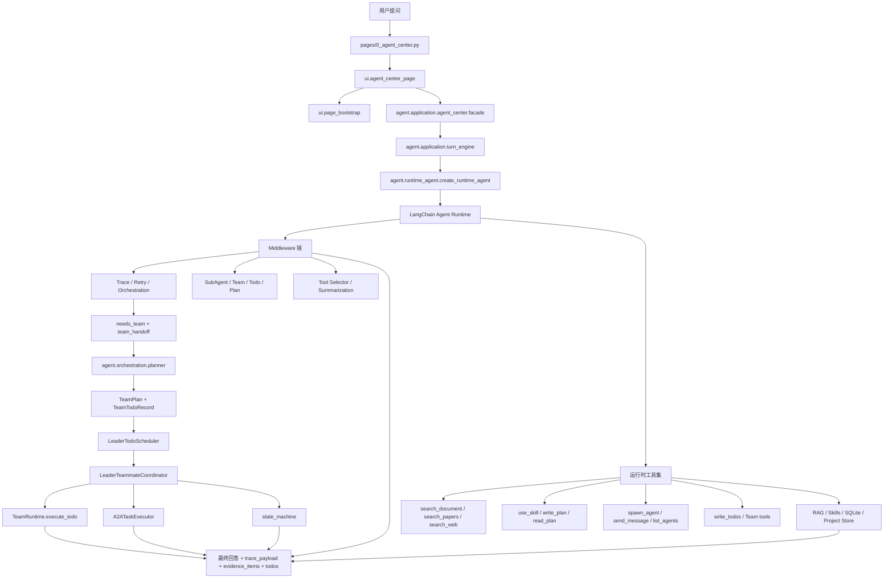
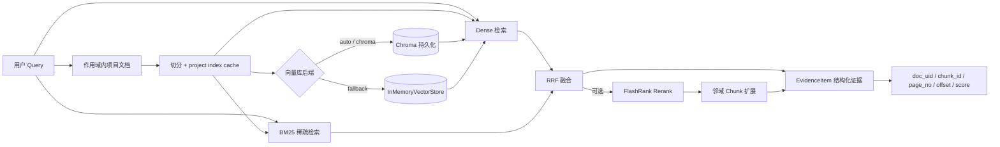
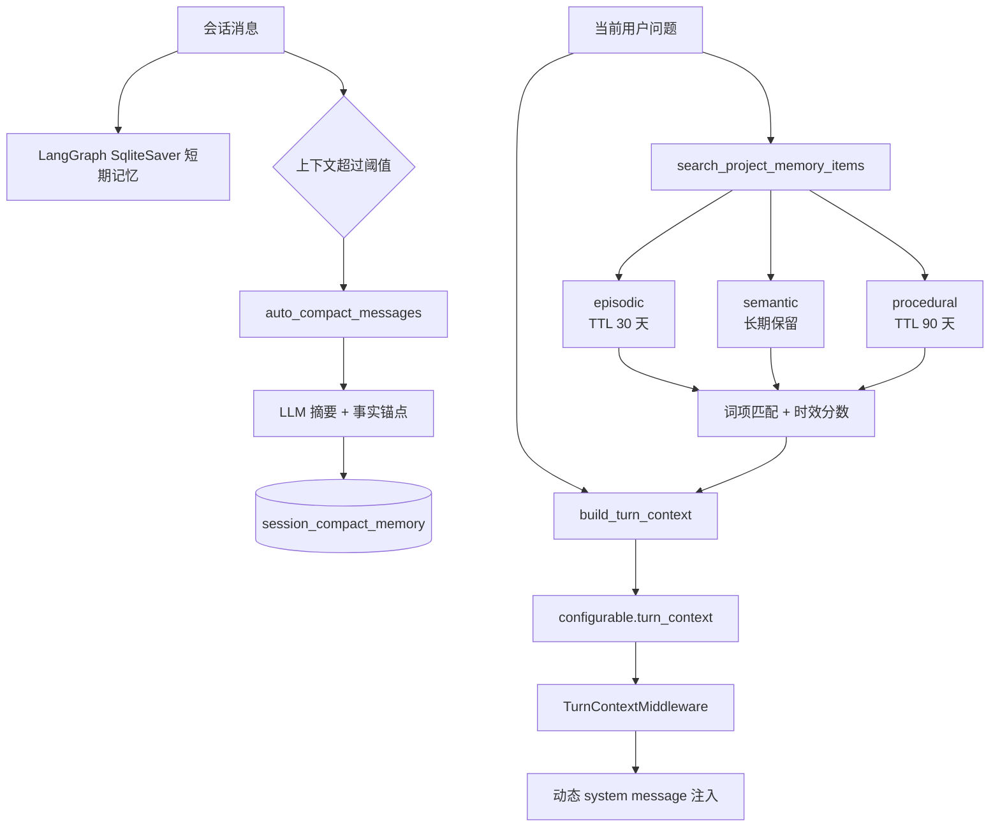

<div align="center">

# 📚 PaperSage

**面向科研阅读与写作的 AI 智能体工作台**

[](https://www.python.org/)
[](CHANGELOG.md)
[](LICENSE)
[](https://python.langchain.com/)
[](https://langchain-ai.github.io/langgraph/)
[](https://streamlit.io/)
[](https://google.github.io/A2A/)
[](Dockerfile)
[](https://github.com/astral-sh/uv)

[English](README_EN.md) · [简体中文](#) · [CHANGELOG](CHANGELOG.md) · [文档](docs/)

</div>

---

<div align="center">


> 基于 **Streamlit + LangChain + LangGraph** 构建。  
> 以"项目化论文问答工作台"为核心：按项目组织文档、限定检索范围、自动路由 Agent 工作流、输出可追溯证据。

</div>

---

## ✨ 核心能力一览

| 能力 | 说明 |
|------|------|
| 🔀 **中间件驱动编排** | `OrchestrationMiddleware` 基于复杂度分析注入计划提示，并在团队任务下发出结构化 `team_handoff` 信号，主链路仍由 `turn_engine + runtime_agent` 驱动 |
| 🤝 **Leader-Teammate 协作运行时** | `agent.orchestration` 已提供 `planner / scheduler / coordinator / state_machine / executors`，由 Leader 生成 `TeamPlan`、按 todo 依赖调度 teammate，并保留 reviewer 检查点 |
| 🔍 **项目级 Hybrid RAG** | 作用域文档切分、Dense + BM25 + RRF、可选 FlashRank Rerank、邻域 Chunk 扩展、结构化证据回传 |
| 💾 **可持久化向量存储** | `AGENT_VECTORSTORE_BACKEND=auto` 优先使用 Chroma，本地不可用时自动回退 `InMemoryVectorStore` |
| 🧠 **上下文治理与记忆** | `SqliteSaver` 会话记忆、自动压缩摘要、项目级长期记忆（episodic / semantic / procedural） |
| 🛠️ **运行时工具集** | 文档检索/阅读、学术搜索、联网搜索、技能调用、计划/Todo、Team 工具按运行时装配 |
| 📝 **可插拔技能体系** | 内置 `summary` / `critical_reading` / `method_compare` / `translation` / `mindmap` / `agentic_search` 六类技能 |
| 🗂️ **项目化工作区** | 多项目隔离、文档绑定、独立会话、会话消息与线程 ID 持久化 |

---

## 🖼️ 功能截图

### Agent 中心 — 智能问答


### Agent 中心 — Team 运行时协作
当任务需要拆解为多个子任务时，系统会先由 `OrchestrationMiddleware` 分析复杂度，并在需要多角色协作时输出 `team_handoff`。当前 Team 能力采用 **Leader 调度 teammate** 的结构化链路：Leader 生成 `TeamPlan`，todo 依赖作为调度拓扑，`TeamRuntime` 负责本地执行，`A2ATaskExecutor` 负责远端协议执行。

- **复杂度判断与结构化 handoff**：对多步骤分析、调研或写作任务，middleware 会建议主 Agent 使用 `write_plan`、`write_todos` 或 Team 路径；在团队任务下，它只记录 `team_handoff`，不会绕过 Leader 直接 dispatch。
- **todo 依赖拓扑调度**：Leader 通过 `build_leader_team_plan` 产出 `TeamPlan` 与 `TeamTodoRecord`，`LeaderTodoScheduler` 基于 `depends_on` 计算 `ready / blocked / failed`，而不是额外维护一套平行 DAG。
- **统一执行后端**：本地 teammate 通过 `TeamRuntime.execute_todo` 执行，远端协议任务通过 `A2ATaskExecutor` 执行，两者都返回统一的 `TaskExecutionResult`。
- **Leader 闭环收口**：reviewer 检查点、状态迁移与最终输出都由 `LeaderTeammateCoordinator + state_machine` 收口，最终回答仍由 Leader 对用户输出。

**💡 当前代码链路示例：**
1. 用户提出需要分工处理的多步骤任务。
2. `OrchestrationMiddleware` 对团队任务写入 `needs_team + team_handoff`，但不直接启动子任务。
3. Leader 调用 `build_leader_team_plan` 生成角色、todo 和完成条件，并将依赖满足的 todo 标记为 `ready`。
4. `LeaderTeammateCoordinator` 结合 `LeaderTodoScheduler` 选择 ready todo，分别通过 `TeamRuntime` 或 `A2ATaskExecutor` 执行。
5. reviewer 检查点通过显式状态机推进 `reviewing / replanning / completed`。
6. 最终回答仍由 Leader 整合输出，并保留 trace、证据和 Todo 状态。


### 文件中心 — 文档管理


### 论文问答 — 证据追溯


### 思维导图 — 可视化


### 论文总结


### 上下文治理 — 可视化


---

## 🏗️ 架构设计

### 当前分层执行链路



当前 canonical 入口仍是 `pages -> ui -> agent.application -> runtime_agent + middlewares`。不同之处在于，团队任务已经从“仅提示主 Agent 使用 team 工具”升级为“middleware 发信号，Leader 在 `agent.orchestration` 中构建计划、调度 todo、选择 backend，并由状态机控制 review/replan/finalize”。

### Hybrid RAG 检索管线



### 长短期记忆架构



---

## 📄 页面导航

| 页面 | 说明 |
|------|------|
| 🤖 **Agent 中心**（默认） | 智能问答主界面，工作流可视化，证据展示 |
| 📁 **文件中心** | 文档上传、格式转换、内容预览 |
| ⚙️ **设置中心** | API Key、模型、RAG 参数、Agent 行为配置 |
| 🗂️ **项目中心** | 项目管理、文档绑定、工作区切换 |

---

## 🚀 快速开始

### 方式一：PyPI 安装（推荐）

> 适合直接使用，无需克隆仓库。

**Linux / macOS**

```bash
# 安装（推荐 uv tool，自动注册全局命令）
uv tool install paper-sage

# 启动
paper-sage
```

**Windows（PowerShell）**

```powershell
# 安装
uv tool install paper-sage

# 启动（Windows 下用不带连字符的命令）
papersage
```

> ⚠️ **不要用 `uv pip install`**：该方式不会将命令写入全局 PATH，需手动激活虚拟环境后才能使用。

浏览器访问 `http://localhost:8501`，在 **⚙️ 设置中心** 填写 API Key 和模型名称即可开始使用。

---

### 方式二：克隆源码本地启动

```bash
# 克隆仓库
git clone https://github.com/0verL1nk/PaperSage.git
cd PaperSage

# 安装依赖
uv sync --no-install-project

# 启动应用
streamlit run main.py
```

### 方式三：Docker 部署

```bash
docker-compose up --build
```

- `docker-compose` 模式默认启用 MinerU 解析（`DOC_PARSE_BACKEND=mineru`）。
- 直接本地 `streamlit run main.py` 不会启用 MinerU，仍使用本地解析链路（MarkItDown / PyMuPDF）。
- 若本地没有 `mineru:latest` 镜像，请先按 MinerU 官方文档构建或在 `.env` 中改 `MINERU_IMAGE`。

---

### 环境要求

- Python `>= 3.11`
- [uv](https://github.com/astral-sh/uv)（推荐包管理器）

---

## 🗂️ 项目结构

```text
.
├── main.py                     # Streamlit 导航与 CLI 入口
├── pages/                      # 薄页面入口（Agent / 文件 / 设置 / 项目）
├── ui/                         # UI 组件、页面控制与 bootstrap
│   ├── agent_center/           #   Agent 中心 controller / state / view
│   └── page_bootstrap.py       #   页面公共初始化
├── agent/                      # 🧠 Agent 核心
│   ├── application/            #   用例编排与 turn 执行
│   ├── domain/                 #   领域契约、trace、请求上下文
│   ├── adapters/               #   SQLite / LLM / 项目 / Session 适配
│   ├── middlewares/            #   编排、Team、Todo、Plan、Trace、摘要
│   ├── orchestration/          #   Leader TeamPlan / scheduler / coordinator / executors / state machine
│   ├── team/                   #   会话级 TeamRuntime
│   ├── rag/                    #   Hybrid RAG（切分/检索/证据/向量库）
│   ├── memory/                 #   压缩摘要与长期记忆
│   ├── tools/                  #   文档/搜索/技能/计划/Team 工具
│   ├── subagent/               #   文件式子 Agent 配置
│   ├── skills/                 #   内置技能模板
│   └── a2a/                    #   A2A 兼容与协议对象
├── utils/                      # 遗留兼容与通用工具
├── tests/                      # 单元 / 集成 / eval
├── docs/                       # 设计文档与开发记录
├── models/embeddings/          # 本地嵌入模型缓存
├── pyproject.toml              # 项目配置（hatch + uv）
├── Dockerfile                  # 容器构建
└── docker-compose.yml          # 容器编排
```

---

## ⚙️ 主要环境变量

<details>
<summary>点击展开完整配置</summary>

```bash
# LLM 接入
OPENAI_COMPATIBLE_BASE_URL=https://dashscope.aliyuncs.com/compatible-mode/v1

# RAG
LOCAL_RAG_HYBRID_ENABLED=true
LOCAL_RAG_TOP_K=8
LOCAL_RAG_RERANK_ENABLED=false
AGENT_VECTORSTORE_BACKEND=auto
AGENT_VECTORSTORE_PERSIST_DIR=./.cache/vector_db

# Agent 行为
AGENT_TEMPERATURE=0.1
AGENT_ENABLE_THINKING=false
AGENT_REASONING_EFFORT=
AGENT_POLICY_ROUTER_MODEL_NAME=
AGENT_POLICY_ROUTER_BASE_URL=
AGENT_POLICY_ROUTER_API_KEY=
AGENT_POLICY_ROUTER_TEMPERATURE=0.0

# 编排与团队
AGENT_TEAM_MAX_MEMBERS=3
AGENT_TEAM_MAX_ROUNDS=2
AGENT_PLANNER_MIN_STEPS=2
AGENT_PLANNER_MAX_STEPS=4

# 工具开关
AGENT_DISABLE_SEARCH_WEB=false
AGENT_TODO_FILE=.agent/todo.json
AGENT_HISTORY_PAGE_SIZE=40
AGENT_PROJECT_INDEX_CACHE_DIR=./.cache/project_indexes

# 日志
APP_LOG_LEVEL=INFO
```

</details>

---

## 🧭 Plan 术语约定

为避免主链路、A2A、观测统计之间语义漂移，约定如下：

| 术语 | 定义 |
|------|------|
| `plan` | planner 产出的结构化执行计划（`ExecutionPlan`） |
| `replan` | 真实计划修订事件（revised plan） |
| `policy_switch` | 路由策略切换事件，不代表计划修订 |
| `step` | 单 agent 计划中的最小可执行动作（可带 `depends_on`） |
| `review` | A2A reviewer 回路事件（不等于单 agent verifier） |
| `verifier` | 单 agent step 校验阶段（对应 `step_verify`） |

更多约束见：`docs/single-agent-plan.md`

---

## 🧩 工具加载与 Schema 暴露

为降低工具数量增长带来的上下文开销，运行时采用“工具已注册 + Schema 按级别暴露”的策略。

| 项目 | 说明 |
|------|------|
| `tool_load` 事件 | 仅输出摘要（`registered/schema_ready/schema_lazy + tools preview`），避免一次性展开全部工具详情 |
| `AGENT_TOOL_SCHEMA_LEVEL=manifest`（默认） | 仅暴露工具元信息（`name/description`），不注入参数 JSON Schema |
| `AGENT_TOOL_SCHEMA_LEVEL=compact` | 暴露轻量参数摘要（字段名 + required） |
| `AGENT_TOOL_SCHEMA_LEVEL=full` | 暴露完整 JSON Schema（调试/开发场景建议按需开启） |

示例：

```bash
# 默认推荐：最小上下文占用
AGENT_TOOL_SCHEMA_LEVEL=manifest
```

---

## 🧪 测试

```bash
# 安装开发依赖
uv sync --extra dev --no-install-project

# 单元测试
uv run --extra dev python -m pytest tests/unit -q

# 集成测试
uv run --extra dev python -m pytest tests/integration -q

# Live API E2E（需配置真实 API Key）
uv run --extra dev python -m pytest tests/integration/test_live_api_e2e.py -q
```

### Task Completion Eval

```bash
# 端到端任务完成率 baseline（默认使用共享 .env 中的 judge 配置）
make eval-baseline

# 覆盖 judge 模型或 base URL
make eval-baseline-judge \
  JUDGE_MODEL="<judge-model-name>" \
  JUDGE_BASE_URL="<optional-openai-compatible-base-url>"

# 少量真实 smoke（真实 create_paper_agent_session + execute_turn_core，默认 1 条 case）
make eval-live-smoke EVAL_CASE_ID=hybrid_research_001 EVAL_LIMIT=1
```

说明：
- 这套 eval 面向 PaperSage 的端到端任务完成，不绑定 middleware 私有细节。
- 最终回答评分统一使用 `success_rubric + LLM-as-judge`，不再支持关键词匹配 contract。
- process 层仍只检查稳定 contract，例如证据覆盖、计划完成率、显式要求的工具使用。
- baseline 与 live smoke 默认读取 `EVAL_ENV_FILE=/home/ling/LLM_App_Final/.env`。
- `build_trajectory_llm_as_judge` 现在会把每个 case 的 `prompt` 与 `success_rubric` 传给 judge，避免只看轨迹不看任务目标。
- 复杂度路由不再使用关键词启发式兜底；若模型不支持 structured output，会退回文本 JSON 解析，若 LLM 判断不可用则返回 neutral result，不强行注入规划提示。
- 现有 `tests/evals/run_phase0_router_baseline.py` 仍保留，它只衡量路由行为，不代表任务是否完成。
- 详细 fixture schema、反馈闭环和报告说明见 [docs/agent-evals.md](docs/agent-evals.md)。
---

## ✅ 质量检查（Lint / Typecheck）

```bash
# Core（阻塞门禁，建议本地与 CI 必跑）
bash scripts/quality_gate.sh core

# Full（全量扫描，当前用于持续收敛，可逐步升级为阻塞）
bash scripts/quality_gate.sh full
```

说明：
- `core`：覆盖主入口与关键模块（`main.py`、`agent/domain`、`agent/tools`、`agent/application/contracts.py`）。
- `full`：覆盖全仓 `ruff` 与全量 `agent` 的 `mypy`。
- CI 已配置分层门禁：`core` 阻塞、`full` 当前非阻塞（progressive rollout）。

---

## 📦 技术栈

| 技术 | 用途 |
|------|------|
| **Streamlit** | Web UI 框架 |
| **LangChain / LangGraph** | LLM 编排与 Agent 状态机 |
| **FastEmbed** (bge-small-zh) | 本地向量嵌入 |
| **FlashRank** | 本地 Rerank |
| **rank_bm25** | 稀疏检索 |
| **a2a-sdk** | Google A2A 协议兼容 |
| **SQLite** | 记忆与数据持久化 |
| **Redis + RQ** | 异步任务队列 |
| **pyecharts** | 思维导图可视化 |
| **Docker** | 容器化部署 |

---

## 📄 License

[MIT](LICENSE)

---

## 🤝 贡献

欢迎提交 Issue / PR ❤️
