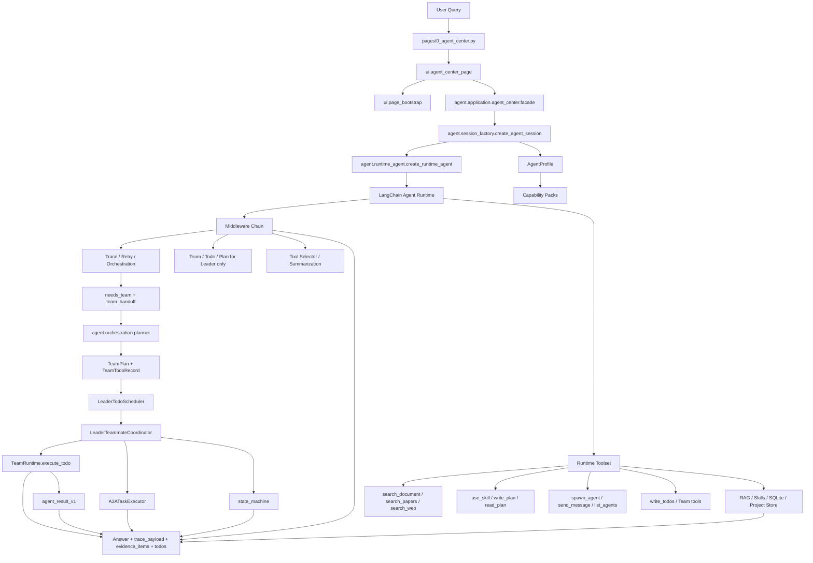
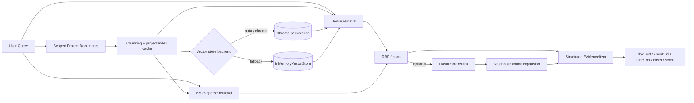
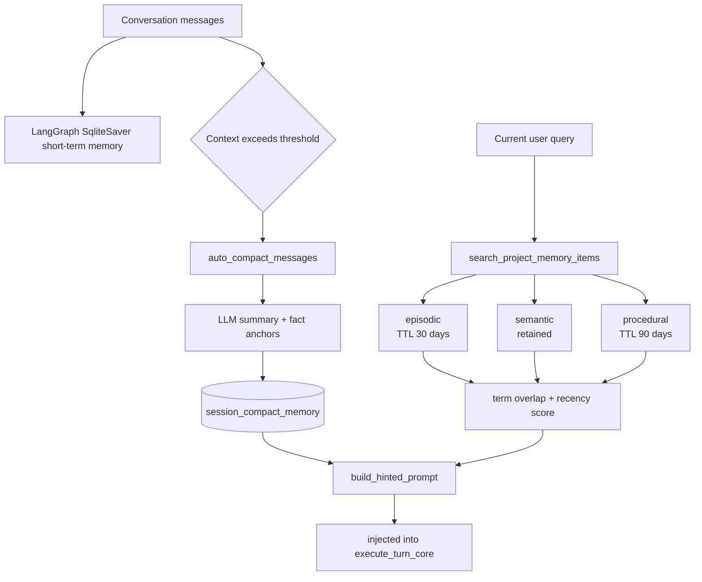

<div align="center">

# 📚 PaperSage

**AI-Powered Research Reading & Writing Workbench**

[](https://www.python.org/)
[](CHANGELOG.md)
[](LICENSE)
[](https://python.langchain.com/)
[](https://langchain-ai.github.io/langgraph/)
[](https://streamlit.io/)
[](https://google.github.io/A2A/)
[](Dockerfile)
[](https://github.com/astral-sh/uv)

[简体中文](README.md) · [English](#) · [CHANGELOG](CHANGELOG.md) · [Docs](docs/)

</div>

---

<div align="center">


> Built with **Streamlit + LangChain + LangGraph**.  
> A project-scoped research workbench: organise documents by project, scope retrieval to the active context, orchestrate the agent pipeline through the application layer and middleware chain, and surface traceable evidence plus execution traces.

</div>

---

## ✨ Feature Overview

| Feature | Description |
|---------|-------------|
| 🔀 **Middleware-Guided Orchestration** | `OrchestrationMiddleware` analyses task complexity, injects planning guidance, and emits a structured `team_handoff` signal for team-eligible work; the main path is still driven by `turn_engine + runtime_agent` |
| 🤝 **Leader-Teammate Runtime** | `agent.orchestration` now provides `planner / scheduler / coordinator / state_machine / executors`, and the Leader uses a profile-aware `TeamRuntime` to create isolated teammate/reviewer sessions, dispatch dependency-aware todos, and read structured teammate results |
| 🔍 **Project-Scoped Hybrid RAG** | Scoped document chunking, Dense + BM25 + RRF, optional FlashRank rerank, neighbour chunk expansion, and structured evidence payloads |
| 💾 **Persistent Vector Store with Fallback** | `AGENT_VECTORSTORE_BACKEND=auto` prefers local Chroma persistence and falls back to `InMemoryVectorStore` when unavailable |
| 🧠 **Context Governance & Memory** | `SqliteSaver` session memory, auto-compacted summaries, and project-level long-term memory (`episodic / semantic / procedural`) |
| 🛠️ **Runtime Tooling** | Document retrieval/reading, academic search, web search, skills, plan/Todo utilities, and Team tools are assembled by profile + capability packs at runtime; `search_document` now suppresses repeated identical and normalized-equivalent queries within a session |
| 📝 **Pluggable Skills** | Six packaged skills: `summary`, `critical_reading`, `method_compare`, `translation`, `mindmap`, and `agentic_search` |
| 🗂️ **Project Workspaces** | Multi-project isolation, document binding, independent sessions, and persisted thread/session state |

---

## 🖼️ Screenshots

### Agent Center — Intelligent Q&A


### Agent Center — Team Runtime Collaboration
When a task needs to be broken into subtasks, the runtime first uses `OrchestrationMiddleware` to assess complexity and emits `team_handoff` when multi-role work is appropriate. The current Team implementation follows a **Leader dispatching teammates** model: the Leader builds a `TeamPlan`, todo dependencies act as the execution topology, `TeamRuntime` handles local execution, and `A2ATaskExecutor` covers protocol-based remote execution.

- **Complexity analysis plus structured handoff**: for multi-step research, analysis, or writing tasks, middleware suggests `write_plan`, `write_todos`, or Team mode; for team work it records `team_handoff` but does not bypass the Leader by dispatching tasks directly.
- **Dependency-aware todo scheduling**: the Leader uses `build_leader_team_plan` to produce `TeamPlan` and `TeamTodoRecord`, and `LeaderTodoScheduler` derives `ready / blocked / failed` from `depends_on` instead of maintaining a second parallel DAG.
- **Unified execution backends**: local teammate tasks run through `TeamRuntime.execute_todo`, while protocol-backed tasks run through `A2ATaskExecutor`, both returning the same `TaskExecutionResult` contract.
- **Profile-aware teammates**: `spawn_agent` now creates isolated worker / reviewer sessions by `role/profile`. Workers do not receive Team / Plan / Todo middleware and cannot recursively dispatch more teammates.
- **Structured teammate results**: `get_agent_result` returns `agent_result_v1` JSON with `status / summary / output / evidence / risks / artifacts`, so the Leader consumes structured intermediates rather than raw chat history.
- **Leader-owned finalisation**: reviewer checkpoints, workflow transitions, and the final answer are closed out by `LeaderTeammateCoordinator + state_machine`, so the user still talks to the Leader rather than to a teammate.

**💡 Current code-path example:**
1. The user submits a multi-step task that benefits from delegation.
2. `OrchestrationMiddleware` writes `needs_team + team_handoff` for eligible tasks, but does not start sub-tasks by itself.
3. The Leader calls `build_leader_team_plan` to produce roles, todos, and completion criteria, and marks dependency-satisfied todos as `ready`.
4. `LeaderTeammateCoordinator` combines `LeaderTodoScheduler` with `TeamRuntime` or `A2ATaskExecutor` to execute ready todos through the selected backend.
5. Reviewer checkpoints move the run through explicit `reviewing / replanning / completed` transitions.
6. The final response is still assembled by the Leader, with trace, evidence, and Todo state preserved.


### File Center — Document Management


### Paper Q&A — Evidence Tracing


### Mind Map — Visualization


### Paper Summary


### Context Governance — Visualization


---

## 🏗️ Architecture

### Current Layered Execution Flow



The canonical path remains `pages -> ui -> agent.application -> runtime_agent + middlewares`. The difference is that team work is no longer just a prompt-level suggestion: middleware emits the signal, and the Leader uses `agent.orchestration` to build the plan, schedule todos, choose the backend, and control review/replan/finalise transitions.

### Hybrid RAG Pipeline



### Memory Architecture



---

## 📄 Pages

| Page | Description |
|------|-------------|
| 🤖 **Agent Center** (default) | Main Q&A interface — workflow visualisation, evidence panel |
| 📁 **File Center** | Document upload, format conversion, content preview |
| ⚙️ **Settings** | API key, model, RAG params, agent behaviour config |
| 🗂️ **Project Center** | Project management, document binding, workspace switching |

---

## 🚀 Quick Start

### Option 1: Install from PyPI (Recommended)

> No need to clone the repository.

**Linux / macOS**

```bash
# Install via uv tool (registers the command globally)
uv tool install paper-sage

# Launch
paper-sage
```

**Windows (PowerShell)**

```powershell
# Install
uv tool install paper-sage

# Launch (use the no-hyphen alias on Windows)
papersage
```

> ⚠️ **Avoid `uv pip install`**: it does not register the command in your global PATH. You would need to activate the virtual environment manually first.

Open `http://localhost:8501` and configure your API key in **⚙️ Settings**.

---

### Option 2: Clone & Run Locally

```bash
git clone https://github.com/0verL1nk/PaperSage.git
cd PaperSage

# Install dependencies
uv sync --no-install-project

# Start the app
streamlit run main.py
```

### Option 3: Docker

```bash
docker-compose up --build
```

---

### Requirements

- Python `>= 3.11`
- [uv](https://github.com/astral-sh/uv) (recommended)

---

## 🗂️ Project Structure

```text
.
├── main.py                     # Streamlit navigation and CLI entry
├── pages/                      # Thin page entries (Agent / Files / Settings / Projects)
├── ui/                         # UI components, page control, and bootstrap
│   ├── agent_center/           #   Agent Center controller / state / view
│   └── page_bootstrap.py       #   Shared page initialisation
├── agent/                      # 🧠 Agent core
│   ├── application/            #   Use-case orchestration and turn execution
│   ├── domain/                 #   Contracts, trace, request context
│   ├── adapters/               #   SQLite / LLM / project / session adapters
│   ├── middlewares/            #   Orchestration, Team, Todo, Plan, Trace, summarisation
│   ├── orchestration/          #   Leader TeamPlan / scheduler / coordinator / executors / state machine
│   ├── team/                   #   Session-scoped TeamRuntime
│   ├── rag/                    #   Hybrid RAG (chunking / retrieval / evidence / vector store)
│   ├── memory/                 #   Compact summaries and long-term memory
│   ├── tools/                  #   Document / search / skill / plan / Team tools
│   ├── subagent/               #   File-based sub-agent prompts
│   ├── skills/                 #   Packaged skill templates
│   └── a2a/                    #   A2A-compatible protocol objects
├── utils/                      # Legacy compatibility and shared utilities
├── tests/                      # Unit / integration / eval
├── docs/                       # Design docs & dev notes
├── models/embeddings/          # Local embedding model cache
├── pyproject.toml              # Package config (hatch + uv)
├── Dockerfile
└── docker-compose.yml
```

---

## ⚙️ Environment Variables

<details>
<summary>Click to expand full configuration</summary>

```bash
# LLM
OPENAI_COMPATIBLE_BASE_URL=https://dashscope.aliyuncs.com/compatible-mode/v1

# RAG
LOCAL_RAG_HYBRID_ENABLED=true
LOCAL_RAG_TOP_K=8
LOCAL_RAG_RERANK_ENABLED=false

# Agent behaviour
AGENT_TEMPERATURE=0.1
AGENT_ENABLE_THINKING=false
AGENT_REASONING_EFFORT=            # low / medium / high (OpenAI)

# Orchestration & team
AGENT_TEAM_MAX_MEMBERS=3
AGENT_TEAM_MAX_ROUNDS=2
AGENT_PLANNER_MIN_STEPS=2
AGENT_PLANNER_MAX_STEPS=4

# Routing thresholds
AGENT_POLICY_SCORE_PLAN=2
AGENT_POLICY_SCORE_TEAM=4

# Tools
AGENT_DISABLE_SEARCH_WEB=false
AGENT_TODO_FILE=.agent/todo.json
AGENT_HISTORY_PAGE_SIZE=40
AGENT_PROJECT_INDEX_CACHE_DIR=./.cache/project_indexes

# Logging
APP_LOG_LEVEL=INFO
```

</details>

---

## 🧪 Testing

```bash
# Install dev dependencies
uv sync --extra dev --no-install-project

# Unit tests
uv run --extra dev python -m pytest tests/unit -q

# Integration tests
uv run --extra dev python -m pytest tests/integration -q

# Live API E2E (requires real API key)
uv run --extra dev python -m pytest tests/integration/test_live_api_e2e.py -q
```

---

## 📦 Tech Stack

| Technology | Purpose |
|------------|---------|
| **Streamlit** | Web UI framework |
| **LangChain / LangGraph** | LLM orchestration & agent state machine |
| **FastEmbed** (bge-small-zh) | Local vector embeddings |
| **FlashRank** | Local reranking |
| **rank_bm25** | Sparse retrieval |
| **a2a-sdk** | Google A2A protocol compatibility |
| **SQLite** | Memory & data persistence |
| **Redis + RQ** | Async task queue |
| **pyecharts** | Mind map visualisation |
| **Docker** | Containerised deployment |

---

## 📄 License

[MIT](LICENSE)

---

## 🤝 Contributing

Issues and PRs are welcome ❤️
